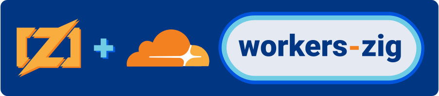

# Workers-Zig



**Workers Zig** is a light weight [**Zig**](https://ziglang.org/) bindings for the [**Cloudflare Workers**](https://workers.cloudflare.com/) environment via [**WebAssembly**](https://webassembly.org/).

Why Zig?
* Zig is a language that is designed to be a small, fast, and portable language that already supports WASM and WASI. To expound on this, the basic example provided here is `5.0Kb` of WASM code and `5.5Kb` javascript code.
* I wanted a tool that supported both WASM and JS code to work in tandem.
* I prefer [**Zigs memory model**](https://www.scattered-thoughts.net/writing/how-safe-is-zig/) over Rust.


Be sure to read the Read the [Documentation](#docs) for guidance on usage.

## Features

- 🤝 Use in tandem with Javascript or 100% Zig WebAssembly
- 🗿 WASI support (coming soon)
- 🎮 JS bindings with support to write your own - [List of supported bindings here](#docs/bindings)
- 📨 Fetch bindings
- ⏰ Scheduled bindings
- 🔑 Supports Variables and Secrets from wrangler `env`
- 📦 KV bindings
- 🪣 R2 bindings
- 💾 D1 bindings (coming soon)
- 🔐 Web-Crypto bindings (coming soon)
- ✨ Cache bindings
- 📌 Durable Objects bindings (coming soon)
- ✉️ WebSockets bindings (coming soon)
- 💪 Uses TypeScript

## Install

### Step 1: Install Zig

[Follow the instructions to install Zig](https://ziglang.org/learn/getting-started/)

Release used: **0.9.1**

### Step 2: Use the skeleton project provided

[Follow the steps provided by the skeleton project](https://github.com/CraigglesO/worker-zig-template)

```bash
git clone --recurse-submodules -j8 git@github.com:CraigglesO/worker-zig-template.git
```

## Example

### Fetch

#### **Zig**

```zig
// NOTE:
// https://github.com/ziglang/zig/issues/3160
// until @asyncCall WASM support is implemented we use a double-up function
export fn basicFetch(ctxID: u32) void {
    // build the ctx
    const ctx = Context.init(ctxID) catch {
        // TODO: throw a js error
        return undefined;
    };
    // build / keep a frame alive
    const frame = allocator.create(@Frame(basicHandler)) catch {
        // TODO: throw a js error
        return undefined;
    };
    frame.* = async basicHandler(ctx);
    // tell the context about the frame for later destruction
    ctx.frame.* = frame;
}
fn basicHandler(ctx: *Context) callconv(.Async) void {
    // get body from request
    // const text = await async ctx.req.text() orelse "failed";
    const text = await async ctx.req.text() orelse return ctx.throw(500, "Failed to get body.");
    defer allocator.free(text);
    // headers
    const headers = Headers.new();
    defer headers.free();
    headers.set("Content-Type", "text/plain");
    // body
    const body = String.new(text);
    defer body.free();
    // response
    const res = Response.new(
        .{ .string = &body },
        .{ .status = 200, .statusText = "ok", .headers = &headers }
    );
    defer res.free();

    ctx.send(&res);
}

export fn add(a: u32, b: u32) u32 {
    return a + b;
}
```

#### **JS/TS Option 1 - Via fetch:**

```ts
import { zigFetch } from 'workers-zig'

export interface Env {}

export default {
  fetch: zigFetch<Env>('basicFetch')
}
```

#### **JS/TS Option 2 - As a route:**

```ts
import { Router } from 'itty-router'
import { zigFetch } from 'workers-zig'

export interface Env {}

const router = Router()
router.get('/', () => new Response('Hello from JS!'))
router.get('/basic', zigFetch<Env>('basicFetch'))

export default {
  fetch: router.handle
}
```

#### **JS/TS Option 3 - as a sub function:**

```ts
import { Router } from 'itty-router'
import { zigFunction, zigAsyncFunction } from 'workers-zig'

const router = Router()
router.get('/', async (req: Request) => {
  const { a, b } = req.json()
  const answer = await zigFunction('add', a, b)
  // use the zigAsyncFunction if your zig function is async
  new Response(`The answer is: ${answer}`)
})

export default {
  fetch: router.handle
}
```
